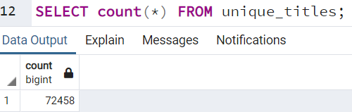
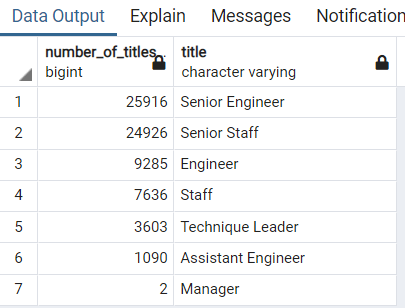
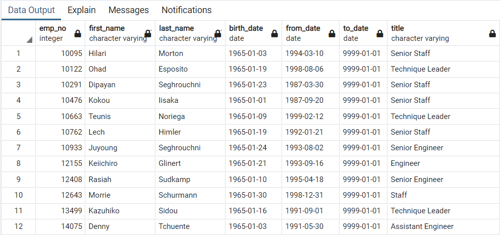

# Upcoming Silver Tsunami Analysis

## Overview of the Upcoming Silver Tsunami Analysis
**The project was created to gather the information regarding retirement-aged employees, their current titles, their departments, and how many of them are among current employees’ data 
to Managers to prepare upcoming employment exchanges by shortening the list with accuracy.**

## Overview of Project:
Using PostgreSQL databases and PostgreSQL function and SQL clauses, such as DISTINCT ON, DATE, INTO, GROUP BY, the program was able to generate unique employees with 
the last their titles, and total numbers by their departments to show managers which departments and what numbers to prepare the upcoming retirements overall statistics.

In addition to the retirement statistics, we also generated mentorship eligibility data to accommodate a mentorship program.

## Results:
<b>Given Current employees information tables such as Employees, Departments, Titles, we could retrieve the number of employees by their most recent job title 
who are about to retire. The DISTINCT ON statement is used specifically, which sorted data by the most recent titles and get information by their id to 
generate their upcoming retirement status</b>
	

## Summary:
It was quite a journey using multiple queries, experimenting with its outcome, but PostgreSQL and ERD, created at the beginning of the process, 
made easy on running statements to generate the following:

### 1. The Number of Retiring Employees by excluding employees that have already left the company, choose the recent title among employee's different titles.
#### Total of 72458 positions were found

[View Result Retirement-Ready List View In CSV](Data/unique_titles.csv)

### 2. With Employee's most recent job title sorted, we were also able, to sum up the total number of retirees by title which helped the manager to foresee upcoming titles’ overall impact

#### Total Number of retirees & Their titles

[View Result of Total Number of retirees by Titles in CSV](Data/retiring_titles.csv)

### 3. In addition to Silver Tsunami, we also generated The Employees Eligible for the Mentorship Program which holds the current employees who were born in 1965
(Note***: The Retirement-Ready employees in the departments will be excluded from participating in the mentor program )
		
#### Total Employees Eligible for the Mentorship

[View Result List of Employees Eligible for the Mentorship in CSV](Data/mentorship_eligibilty.csv)

### Executive Question:
1. How many roles will need to be filled as the "silver tsunami" begins to make an impact?  Answer: 72458 unique positions will be impacted
2. Are there enough qualified, retirement-ready employees in the departments to mentor the next generation of Pewlett Hackard employees? No. The retirement-ready employees won’t be participating in the mentor program by nature of filtering their birth dates.
